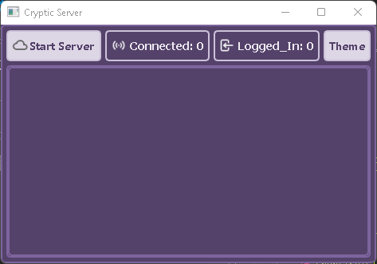
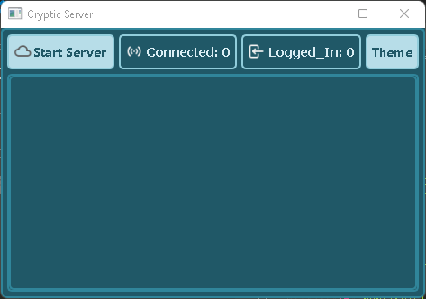
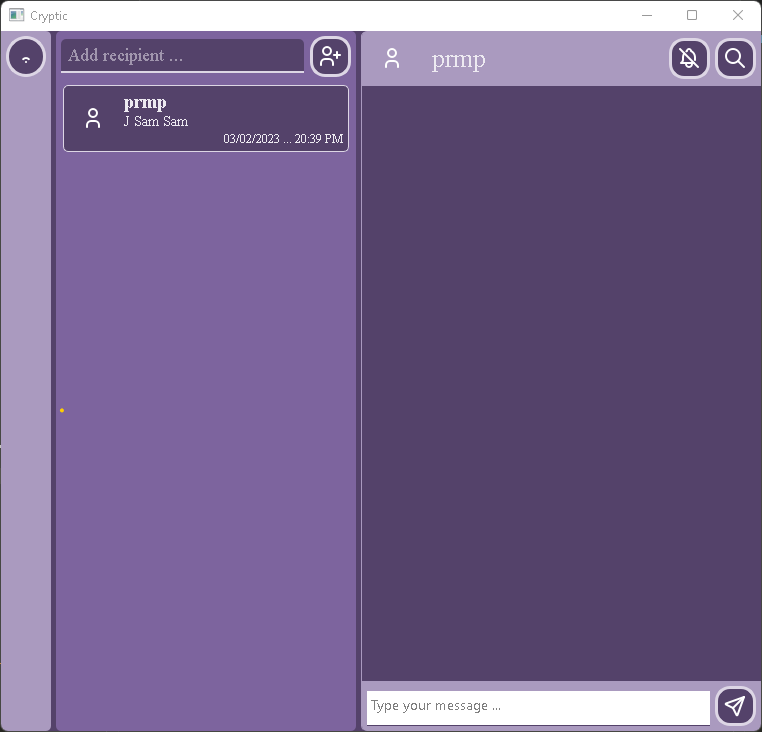
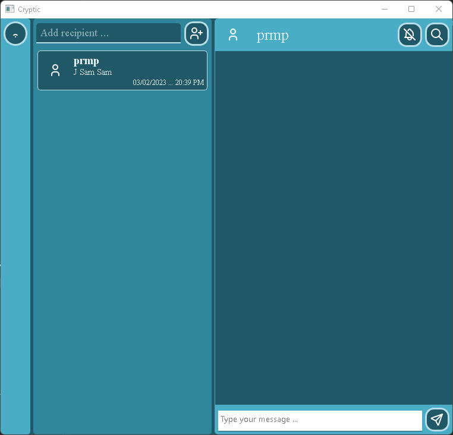

# cryptic
A simple messaging network for secret messaging. You need the ID of the recipient to chat. No random search, everything is hidden/secret.

## Operation
Logging in:
  - ID
  - Key

Recipient:
  - Input ID -- if it exists, chat is created with the ID
             -- as the recipient of the chat.

Profile:
  - ID
  - Key
  - Avatar

Chats:
  -- only text chat is available,text can also include links.
  -- recipients will be stored, and their chats too.

## Images

### Server UI

### Client UI

